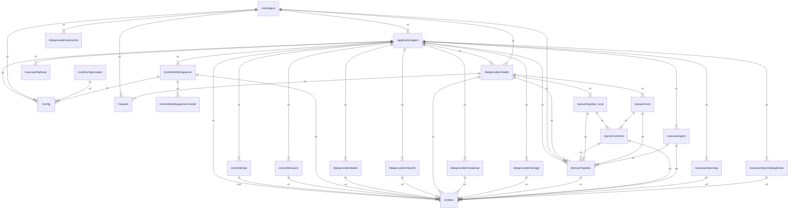

# github.com/gbh007/hgraber-next-agent-core

## Main packages

|     Name      |                    Path                    |
|:-------------:|:------------------------------------------:|
|     agent     |         [/cmd/agent](cmd/agent.md)         |
| configremaper | [/cmd/configremaper](cmd/configremaper.md) |

## Inner packages

|        Name        |                                Path                                |
|:------------------:|:------------------------------------------------------------------:|
|       agent        |             [/application/agent](application/agent.md)             |
|       agent        |                     [/cmd/agent](cmd/agent.md)                     |
|   configremaper    |             [/cmd/configremaper](cmd/configremaper.md)             |
|       config       |                        [/config](config.md)                        |
|        api         |                [/controller/api](controller/api.md)                |
|       async        |              [/controller/async](controller/async.md)              |
|    debugserver     |        [/controller/debugserver](controller/debugserver.md)        |
|       model        |  [/controller/debugserver/model](controller/debugserver/model.md)  |
|       datafs       |           [/dataprovider/datafs](dataprovider/datafs.md)           |
|       files        |            [/dataprovider/files](dataprovider/files.md)            |
|      importfs      |         [/dataprovider/importfs](dataprovider/importfs.md)         |
|       loader       |           [/dataprovider/loader](dataprovider/loader.md)           |
|     masterapi      |        [/dataprovider/masterapi](dataprovider/masterapi.md)        |
|      storage       |          [/dataprovider/storage](dataprovider/storage.md)          |
|      internal      | [/dataprovider/storage/internal](dataprovider/storage/internal.md) |
|      webcache      |         [/dataprovider/webcache](dataprovider/webcache.md)         |
|      hgraber       |                [/domain/hgraber](domain/hgraber.md)                |
|      entities      |                      [/entities](entities.md)                      |
|       common       |                 [/parser/common](parser/common.md)                 |
|   hgraber_local    |          [/parser/hgraber_local](parser/hgraber_local.md)          |
|        mock        |                   [/parser/mock](parser/mock.md)                   |
|      request       |                       [/request](request.md)                       |
|       agent        |                 [/usecase/agent](usecase/agent.md)                 |
|      highway       |               [/usecase/highway](usecase/highway.md)               |
|     importapi      |             [/usecase/importapi](usecase/importapi.md)             |
| importdeduplicator |    [/usecase/importdeduplicator](usecase/importdeduplicator.md)    |

## External imports

|     Name      |                              Path                               | Count |
|:-------------:|:---------------------------------------------------------------:|:-----:|
|    context    |                             context                             |  67   |
|     time      |                              time                               |  36   |
|      fmt      |                               fmt                               |  35   |
|     slog      |                            log/slog                             |  32   |
|      url      |                             net/url                             |  25   |
|    errors     |                             errors                              |  24   |
|      io       |                               io                                |  24   |
|   agentapi    |         github.com/gbh007/hgraber-next/openapi/agentapi         |  18   |
|      os       |                               os                                |  18   |
|     uuid      |                     github.com/google/uuid                      |  16   |
|      pkg      |               github.com/gbh007/hgraber-next/pkg                |  13   |
|     http      |                            net/http                             |  12   |
|     path      |                              path                               |  12   |
|     bytes     |                              bytes                              |  10   |
|    strings    |                             strings                             |   9   |
|      v4       |                   github.com/labstack/echo/v4                   |   5   |
|     otel      |                    go.opentelemetry.io/otel                     |   4   |
|  propagation  |              go.opentelemetry.io/otel/propagation               |   4   |
|    strconv    |                             strconv                             |   4   |
|      sql      |                          database/sql                           |   3   |
|     json      |                          encoding/json                          |   3   |
|    regexp     |                             regexp                              |   3   |
|      md5      |                           crypto/md5                            |   2   |
|     embed     |                              embed                              |   2   |
|    metric     |         github.com/gbh007/hgraber-next/adapters/metric          |   2   |
|    config     |              github.com/gbh007/hgraber-next/config              |   2   |
|   serverapi   |        github.com/gbh007/hgraber-next/openapi/serverapi         |   2   |
|  ogenerrors   |               github.com/ogen-go/ogen/ogenerrors                |   2   |
|     trace     |                 go.opentelemetry.io/otel/trace                  |   2   |
|   template    |                          html/template                          |   2   |
|    runtime    |                             runtime                             |   2   |
|      zip      |                           archive/zip                           |   1   |
|    sha256     |                          crypto/sha256                          |   1   |
|    base64     |                         encoding/base64                         |   1   |
|    binary     |                         encoding/binary                         |   1   |
|      hex      |                          encoding/hex                           |   1   |
|     flag      |                              flag                               |   1   |
| configremaper |    github.com/gbh007/hgraber-next/application/configremaper     |   1   |
|   external    |             github.com/gbh007/hgraber-next/external             |   1   |
|   go-sqlite   |                  github.com/glebarez/go-sqlite                  |   1   |
| pyroscope-go  |                 github.com/grafana/pyroscope-go                 |   1   |
|     sqlx      |                     github.com/jmoiron/sqlx                     |   1   |
|  middleware   |             github.com/labstack/echo/v4/middleware              |   1   |
|  middleware   |               github.com/ogen-go/ogen/middleware                |   1   |
|   validate    |                github.com/ogen-go/ogen/validate                 |   1   |
|      v3       |                   github.com/pressly/goose/v3                   |   1   |
|  prometheus   |         github.com/prometheus/client_golang/prometheus          |   1   |
|   promhttp    |     github.com/prometheus/client_golang/prometheus/promhttp     |   1   |
|      v2       |                 github.com/qustavo/sqlhooks/v2                  |   1   |
|   otelhttp    |  go.opentelemetry.io/contrib/instrumentation/net/http/otelhttp  |   1   |
| otlptracehttp | go.opentelemetry.io/otel/exporters/otlp/otlptrace/otlptracehttp |   1   |
|   resource    |              go.opentelemetry.io/otel/sdk/resource              |   1   |
|     trace     |               go.opentelemetry.io/otel/sdk/trace                |   1   |
|    v1.20.0    |            go.opentelemetry.io/otel/semconv/v1.20.0             |   1   |
|     unix      |                      golang.org/x/sys/unix                      |   1   |
|     html      |                              html                               |   1   |
|     mime      |                              mime                               |   1   |
|    signal     |                            os/signal                            |   1   |
|    slices     |                             slices                              |   1   |
|     sync      |                              sync                               |   1   |
|    syscall    |                             syscall                             |   1   |
|    testing    |                             testing                             |   1   |

## Scheme

---

> Generated by [goArchLint](https://github.com/gbh007/goarchlint)
