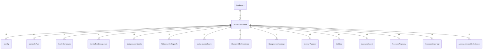

# agent

## Imports

|        Name        |                              Path                               | Inner | Count |
|:------------------:|:---------------------------------------------------------------:|:-----:|:-----:|
|      context       |                             context                             |  ❌   |   3   |
|       config       |                     [/config](../config.md)                     |  ✅   |   3   |
|        slog        |                            log/slog                             |  ❌   |   3   |
|        pkg         |               github.com/gbh007/hgraber-next/pkg                |  ❌   |   2   |
|        otel        |                    go.opentelemetry.io/otel                     |  ❌   |   2   |
|         os         |                               os                                |  ❌   |   2   |
|        flag        |                              flag                               |  ❌   |   1   |
|        fmt         |                               fmt                               |  ❌   |   1   |
|        api         |             [/controller/api](../controller/api.md)             |  ✅   |   1   |
|       async        |           [/controller/async](../controller/async.md)           |  ✅   |   1   |
|    debugserver     |     [/controller/debugserver](../controller/debugserver.md)     |  ✅   |   1   |
|       datafs       |        [/dataprovider/datafs](../dataprovider/datafs.md)        |  ✅   |   1   |
|      importfs      |      [/dataprovider/importfs](../dataprovider/importfs.md)      |  ✅   |   1   |
|       loader       |        [/dataprovider/loader](../dataprovider/loader.md)        |  ✅   |   1   |
|     masterapi      |     [/dataprovider/masterapi](../dataprovider/masterapi.md)     |  ✅   |   1   |
|      storage       |       [/dataprovider/storage](../dataprovider/storage.md)       |  ✅   |   1   |
|      hgraber       |             [/domain/hgraber](../domain/hgraber.md)             |  ✅   |   1   |
|      entities      |                   [/entities](../entities.md)                   |  ✅   |   1   |
|       agent        |              [/usecase/agent](../usecase/agent.md)              |  ✅   |   1   |
|      highway       |            [/usecase/highway](../usecase/highway.md)            |  ✅   |   1   |
|     importapi      |          [/usecase/importapi](../usecase/importapi.md)          |  ✅   |   1   |
| importdeduplicator | [/usecase/importdeduplicator](../usecase/importdeduplicator.md) |  ✅   |   1   |
|       metric       |         github.com/gbh007/hgraber-next/adapters/metric          |  ❌   |   1   |
|       config       |              github.com/gbh007/hgraber-next/config              |  ❌   |   1   |
|    pyroscope-go    |                 github.com/grafana/pyroscope-go                 |  ❌   |   1   |
|   otlptracehttp    | go.opentelemetry.io/otel/exporters/otlp/otlptrace/otlptracehttp |  ❌   |   1   |
|    propagation     |              go.opentelemetry.io/otel/propagation               |  ❌   |   1   |
|      resource      |              go.opentelemetry.io/otel/sdk/resource              |  ❌   |   1   |
|       trace        |               go.opentelemetry.io/otel/sdk/trace                |  ❌   |   1   |
|      v1.20.0       |            go.opentelemetry.io/otel/semconv/v1.20.0             |  ❌   |   1   |
|       trace        |                 go.opentelemetry.io/otel/trace                  |  ❌   |   1   |
|      runtime       |                             runtime                             |  ❌   |   1   |
|        time        |                              time                               |  ❌   |   1   |

## Used by

| Name  |             Path              |
|:-----:|:-----------------------------:|
| agent | [/cmd/agent](../cmd/agent.md) |

## Scheme

---

> Generated by [goArchLint](https://github.com/gbh007/goarchlint)
