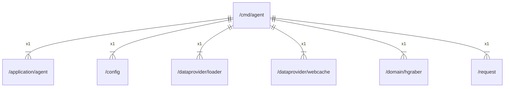

# main

## Imports

|   Name   |                         Path                          | Inner | Count |
|:--------:|:-----------------------------------------------------:|:-----:|:-----:|
| context  |                        context                        |  ❌   |   1   |
|   fmt    |                          fmt                          |  ❌   |   1   |
|  agent   |     [/application/agent](../application/agent.md)     |  ✅   |   1   |
|  config  |                [/config](../config.md)                |  ✅   |   1   |
|  loader  |   [/dataprovider/loader](../dataprovider/loader.md)   |  ✅   |   1   |
| webcache | [/dataprovider/webcache](../dataprovider/webcache.md) |  ✅   |   1   |
| hgraber  |        [/domain/hgraber](../domain/hgraber.md)        |  ✅   |   1   |
| request  |               [/request](../request.md)               |  ✅   |   1   |
|  metric  |    github.com/gbh007/hgraber-next/adapters/metric     |  ❌   |   1   |
|   slog   |                       log/slog                        |  ❌   |   1   |
|  signal  |                       os/signal                       |  ❌   |   1   |
| syscall  |                        syscall                        |  ❌   |   1   |

## Scheme

---

> Generated by [goArchLint](https://github.com/gbh007/goarchlint)
