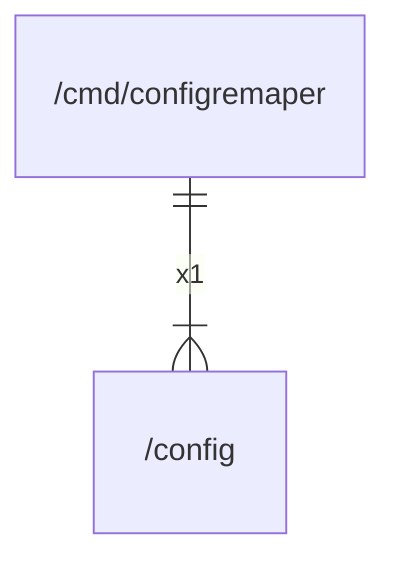

# main

## Imports

|     Name      |                           Path                           | Inner | Count |
|:-------------:|:--------------------------------------------------------:|:-----:|:-----:|
|    config     |                 [/config](../config.md)                  |  ✅   |   1   |
| configremaper | github.com/gbh007/hgraber-next/application/configremaper |  ❌   |   1   |

## Scheme

---

> Generated by [goArchLint](https://github.com/gbh007/goarchlint)
