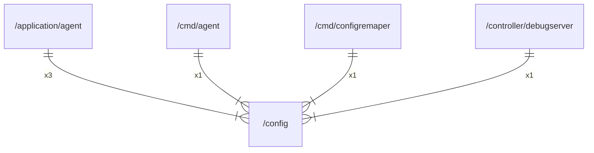

# config

## Imports

|  Name   |   Path   | Inner | Count |
|:-------:|:--------:|:-----:|:-----:|
|  time   |   time   |  ❌   |   3   |
|  slog   | log/slog |  ❌   |   1   |
| strings | strings  |  ❌   |   1   |

## Used by

|     Name      |                         Path                         |
|:-------------:|:----------------------------------------------------:|
|     agent     |      [/application/agent](application/agent.md)      |
|     agent     |              [/cmd/agent](cmd/agent.md)              |
| configremaper |      [/cmd/configremaper](cmd/configremaper.md)      |
|  debugserver  | [/controller/debugserver](controller/debugserver.md) |

## Scheme

---

> Generated by [goArchLint](https://github.com/gbh007/goarchlint)
