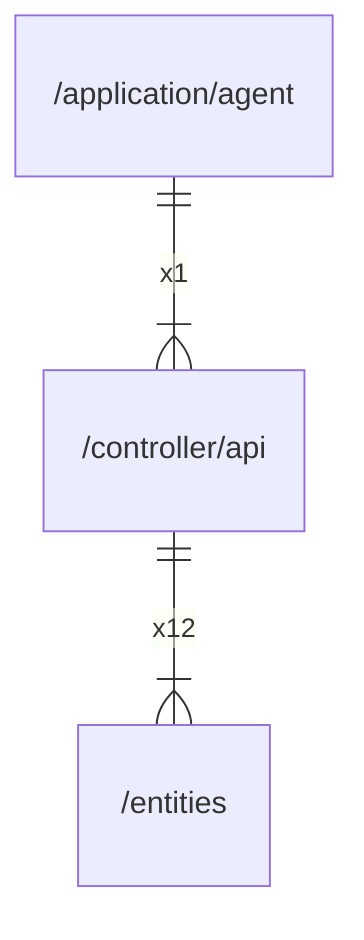

# api

## Imports

|    Name     |                          Path                           | Inner | Count |
|:-----------:|:-------------------------------------------------------:|:-----:|:-----:|
|   context   |                         context                         |  ❌   |  18   |
|  agentapi   |     github.com/gbh007/hgraber-next/openapi/agentapi     |  ❌   |  18   |
|  entities   |               [/entities](../entities.md)               |  ✅   |  12   |
|   errors    |                         errors                          |  ❌   |   7   |
|     pkg     |           github.com/gbh007/hgraber-next/pkg            |  ❌   |   6   |
|    slog     |                        log/slog                         |  ❌   |   4   |
|    http     |                        net/http                         |  ❌   |   3   |
|     url     |                         net/url                         |  ❌   |   3   |
|    time     |                          time                           |  ❌   |   3   |
|     io      |                           io                            |  ❌   |   2   |
|   strings   |                         strings                         |  ❌   |   2   |
|    bytes    |                          bytes                          |  ❌   |   1   |
|    json     |                      encoding/json                      |  ❌   |   1   |
|     fmt     |                           fmt                           |  ❌   |   1   |
|    uuid     |                 github.com/google/uuid                  |  ❌   |   1   |
| middleware  |           github.com/ogen-go/ogen/middleware            |  ❌   |   1   |
| ogenerrors  |           github.com/ogen-go/ogen/ogenerrors            |  ❌   |   1   |
|  validate   |            github.com/ogen-go/ogen/validate             |  ❌   |   1   |
| prometheus  |     github.com/prometheus/client_golang/prometheus      |  ❌   |   1   |
|  promhttp   | github.com/prometheus/client_golang/prometheus/promhttp |  ❌   |   1   |
|    otel     |                go.opentelemetry.io/otel                 |  ❌   |   1   |
| propagation |          go.opentelemetry.io/otel/propagation           |  ❌   |   1   |
|    trace    |             go.opentelemetry.io/otel/trace              |  ❌   |   1   |
|    mime     |                          mime                           |  ❌   |   1   |
|   runtime   |                         runtime                         |  ❌   |   1   |
|   strconv   |                         strconv                         |  ❌   |   1   |

## Used by

| Name  |                     Path                      |
|:-----:|:---------------------------------------------:|
| agent | [/application/agent](../application/agent.md) |

## Scheme

---

> Generated by [goArchLint](https://github.com/gbh007/goarchlint)
