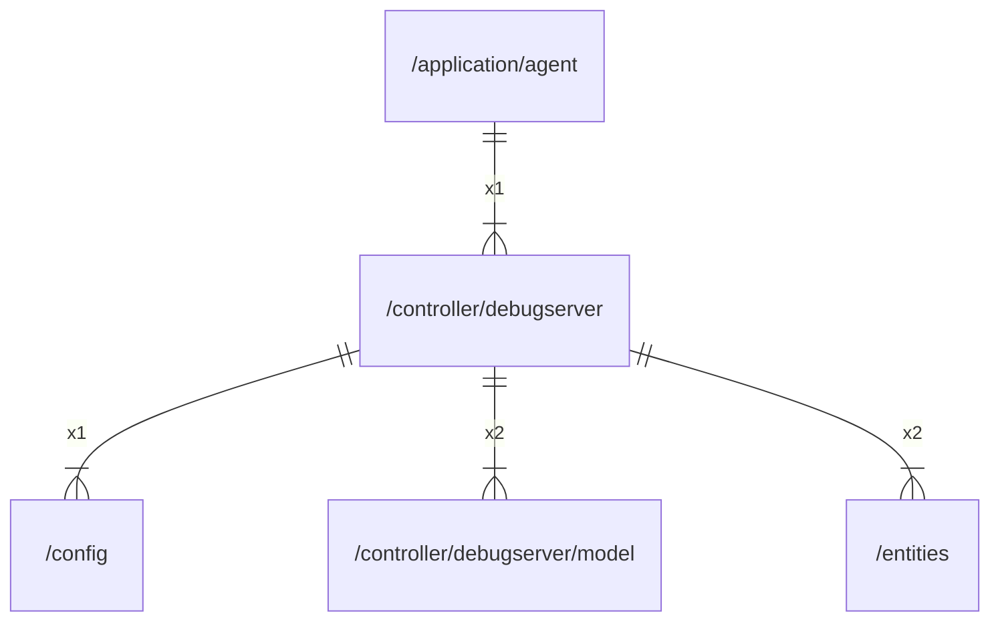

# debugserver

## Imports

|    Name    |                         Path                          | Inner | Count |
|:----------:|:-----------------------------------------------------:|:-----:|:-----:|
|     v4     |              github.com/labstack/echo/v4              |  ❌   |   5   |
|    http    |                       net/http                        |  ❌   |   4   |
|  context   |                        context                        |  ❌   |   3   |
|     io     |                          io                           |  ❌   |   3   |
|   bytes    |                         bytes                         |  ❌   |   2   |
|   model    | [/controller/debugserver/model](debugserver/model.md) |  ✅   |   2   |
|  entities  |              [/entities](../entities.md)              |  ✅   |   2   |
|  template  |                     html/template                     |  ❌   |   2   |
|    slog    |                       log/slog                        |  ❌   |   2   |
|    url     |                        net/url                        |  ❌   |   2   |
|    time    |                         time                          |  ❌   |   2   |
|    zip     |                      archive/zip                      |  ❌   |   1   |
|   embed    |                         embed                         |  ❌   |   1   |
|    json    |                     encoding/json                     |  ❌   |   1   |
|   errors   |                        errors                         |  ❌   |   1   |
|    fmt     |                          fmt                          |  ❌   |   1   |
|   config   |                [/config](../config.md)                |  ✅   |   1   |
|   config   |         github.com/gbh007/hgraber-next/config         |  ❌   |   1   |
|  external  |        github.com/gbh007/hgraber-next/external        |  ❌   |   1   |
|    pkg     |          github.com/gbh007/hgraber-next/pkg           |  ❌   |   1   |
| middleware |        github.com/labstack/echo/v4/middleware         |  ❌   |   1   |
|    path    |                         path                          |  ❌   |   1   |

## Used by

| Name  |                     Path                      |
|:-----:|:---------------------------------------------:|
| agent | [/application/agent](../application/agent.md) |

## Scheme

---

> Generated by [goArchLint](https://github.com/gbh007/goarchlint)
