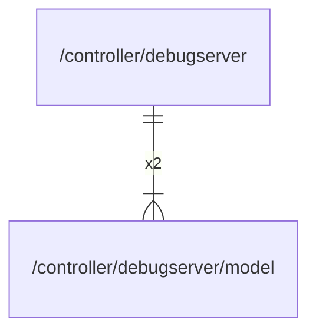

# model

## Imports

|  Name  |  Path  | Inner | Count |
|:------:|:------:|:-----:|:-----:|
| errors | errors |  ❌   |   1   |

## Used by

|    Name     |                     Path                     |
|:-----------:|:--------------------------------------------:|
| debugserver | [/controller/debugserver](../debugserver.md) |

## Scheme

---

> Generated by [goArchLint](https://github.com/gbh007/goarchlint)
