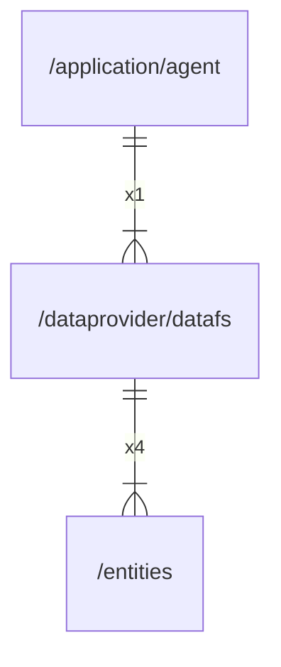

# datafs

## Imports

|   Name   |            Path             | Inner | Count |
|:--------:|:---------------------------:|:-----:|:-----:|
|   fmt    |             fmt             |  ❌   |   5   |
|   uuid   |   github.com/google/uuid    |  ❌   |   5   |
|    os    |             os              |  ❌   |   5   |
|   time   |            time             |  ❌   |   5   |
| context  |           context           |  ❌   |   4   |
| entities | [/entities](../entities.md) |  ✅   |   4   |
|  errors  |           errors            |  ❌   |   3   |
|   slog   |          log/slog           |  ❌   |   3   |
|    io    |             io              |  ❌   |   2   |
|   path   |            path             |  ❌   |   2   |
|  bytes   |            bytes            |  ❌   |   1   |
|   unix   |    golang.org/x/sys/unix    |  ❌   |   1   |

## Used by

| Name  |                     Path                      |
|:-----:|:---------------------------------------------:|
| agent | [/application/agent](../application/agent.md) |

## Scheme

---

> Generated by [goArchLint](https://github.com/gbh007/goarchlint)
