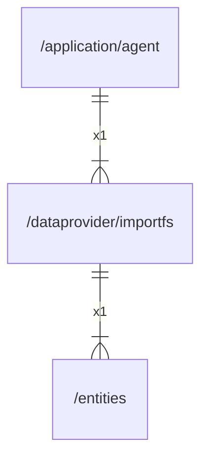

# importfs

## Imports

|   Name   |                Path                | Inner | Count |
|:--------:|:----------------------------------:|:-----:|:-----:|
|    os    |                 os                 |  ❌   |   5   |
|   fmt    |                fmt                 |  ❌   |   4   |
|   time   |                time                |  ❌   |   4   |
| context  |              context               |  ❌   |   3   |
|   path   |                path                |  ❌   |   3   |
|  errors  |               errors               |  ❌   |   2   |
|   uuid   |       github.com/google/uuid       |  ❌   |   2   |
|    io    |                 io                 |  ❌   |   2   |
|   slog   |              log/slog              |  ❌   |   2   |
|  bytes   |               bytes                |  ❌   |   1   |
| entities |    [/entities](../entities.md)     |  ✅   |   1   |
|   pkg    | github.com/gbh007/hgraber-next/pkg |  ❌   |   1   |
| strconv  |              strconv               |  ❌   |   1   |
| strings  |              strings               |  ❌   |   1   |
|   sync   |                sync                |  ❌   |   1   |

## Used by

| Name  |                     Path                      |
|:-----:|:---------------------------------------------:|
| agent | [/application/agent](../application/agent.md) |

## Scheme

---

> Generated by [goArchLint](https://github.com/gbh007/goarchlint)
