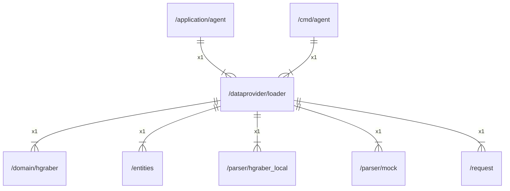

# loader

## Imports

|     Name      |                        Path                         | Inner | Count |
|:-------------:|:---------------------------------------------------:|:-----:|:-----:|
|    context    |                       context                       |  ❌   |   1   |
|    errors     |                       errors                        |  ❌   |   1   |
|      fmt      |                         fmt                         |  ❌   |   1   |
|    hgraber    |       [/domain/hgraber](../domain/hgraber.md)       |  ✅   |   1   |
|   entities    |             [/entities](../entities.md)             |  ✅   |   1   |
| hgraber_local | [/parser/hgraber_local](../parser/hgraber_local.md) |  ✅   |   1   |
|     mock      |          [/parser/mock](../parser/mock.md)          |  ✅   |   1   |
|    request    |              [/request](../request.md)              |  ✅   |   1   |
|      io       |                         io                          |  ❌   |   1   |
|     slog      |                      log/slog                       |  ❌   |   1   |
|      url      |                       net/url                       |  ❌   |   1   |
|     time      |                        time                         |  ❌   |   1   |

## Used by

| Name  |                     Path                      |
|:-----:|:---------------------------------------------:|
| agent | [/application/agent](../application/agent.md) |
| agent |         [/cmd/agent](../cmd/agent.md)         |

## Scheme

---

> Generated by [goArchLint](https://github.com/gbh007/goarchlint)
