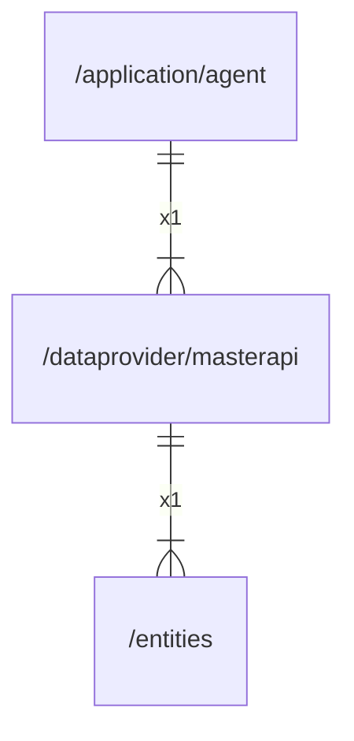

# masterapi

## Imports

|    Name     |                       Path                       | Inner | Count |
|:-----------:|:------------------------------------------------:|:-----:|:-----:|
|   context   |                     context                      |  ❌   |   2   |
|  serverapi  | github.com/gbh007/hgraber-next/openapi/serverapi |  ❌   |   2   |
|     fmt     |                       fmt                        |  ❌   |   1   |
|  entities   |           [/entities](../entities.md)            |  ✅   |   1   |
|     pkg     |        github.com/gbh007/hgraber-next/pkg        |  ❌   |   1   |
| ogenerrors  |        github.com/ogen-go/ogen/ogenerrors        |  ❌   |   1   |
|    otel     |             go.opentelemetry.io/otel             |  ❌   |   1   |
| propagation |       go.opentelemetry.io/otel/propagation       |  ❌   |   1   |
|     io      |                        io                        |  ❌   |   1   |
|    http     |                     net/http                     |  ❌   |   1   |
|     url     |                     net/url                      |  ❌   |   1   |
|    time     |                       time                       |  ❌   |   1   |

## Used by

| Name  |                     Path                      |
|:-----:|:---------------------------------------------:|
| agent | [/application/agent](../application/agent.md) |

## Scheme

---

> Generated by [goArchLint](https://github.com/gbh007/goarchlint)
