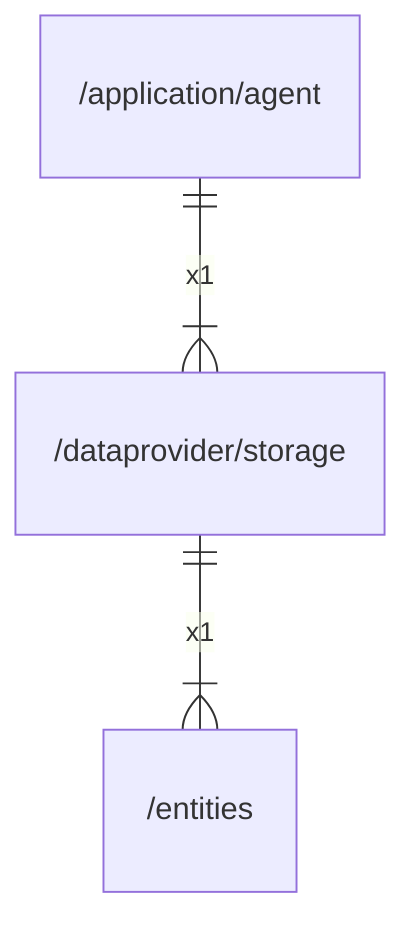

# storage

## Imports

|   Name    |              Path              | Inner | Count |
|:---------:|:------------------------------:|:-----:|:-----:|
|  context  |            context             |  ❌   |   5   |
|    sql    |          database/sql          |  ❌   |   3   |
|   time    |              time              |  ❌   |   3   |
|    fmt    |              fmt               |  ❌   |   2   |
|   slog    |            log/slog            |  ❌   |   2   |
|    url    |            net/url             |  ❌   |   2   |
|   embed   |             embed              |  ❌   |   1   |
| entities  |  [/entities](../entities.md)   |  ✅   |   1   |
| go-sqlite | github.com/glebarez/go-sqlite  |  ❌   |   1   |
|   uuid    |     github.com/google/uuid     |  ❌   |   1   |
|   sqlx    |    github.com/jmoiron/sqlx     |  ❌   |   1   |
|    v3     |  github.com/pressly/goose/v3   |  ❌   |   1   |
|    v2     | github.com/qustavo/sqlhooks/v2 |  ❌   |   1   |
|  regexp   |             regexp             |  ❌   |   1   |

## Used by

| Name  |                     Path                      |
|:-----:|:---------------------------------------------:|
| agent | [/application/agent](../application/agent.md) |

## Scheme

---

> Generated by [goArchLint](https://github.com/gbh007/goarchlint)
