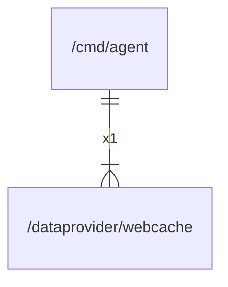

# webcache

## Imports

|  Name   |     Path      | Inner | Count |
|:-------:|:-------------:|:-----:|:-----:|
|  slog   |   log/slog    |  ❌   |   4   |
|   os    |      os       |  ❌   |   4   |
|  path   |     path      |  ❌   |   4   |
|  time   |     time      |  ❌   |   4   |
| context |    context    |  ❌   |   3   |
| errors  |    errors     |  ❌   |   3   |
|   fmt   |      fmt      |  ❌   |   3   |
|   io    |      io       |  ❌   |   2   |
|  bytes  |     bytes     |  ❌   |   1   |
|   md5   |  crypto/md5   |  ❌   |   1   |
| sha256  | crypto/sha256 |  ❌   |   1   |
|   hex   | encoding/hex  |  ❌   |   1   |
| strconv |    strconv    |  ❌   |   1   |
| strings |    strings    |  ❌   |   1   |

## Used by

| Name  |             Path              |
|:-----:|:-----------------------------:|
| agent | [/cmd/agent](../cmd/agent.md) |

## Scheme

---

> Generated by [goArchLint](https://github.com/gbh007/goarchlint)
