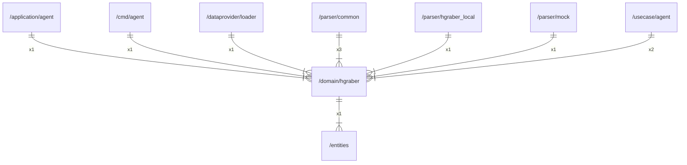

# hgraber

## Imports

|   Name   |            Path             | Inner | Count |
|:--------:|:---------------------------:|:-----:|:-----:|
| context  |           context           |  ❌   |   1   |
|  errors  |           errors            |  ❌   |   1   |
| entities | [/entities](../entities.md) |  ✅   |   1   |
|    io    |             io              |  ❌   |   1   |
|   url    |           net/url           |  ❌   |   1   |

## Used by

|     Name      |                        Path                         |
|:-------------:|:---------------------------------------------------:|
|     agent     |    [/application/agent](../application/agent.md)    |
|     agent     |            [/cmd/agent](../cmd/agent.md)            |
|    loader     |  [/dataprovider/loader](../dataprovider/loader.md)  |
|    common     |        [/parser/common](../parser/common.md)        |
| hgraber_local | [/parser/hgraber_local](../parser/hgraber_local.md) |
|     mock      |          [/parser/mock](../parser/mock.md)          |
|     agent     |        [/usecase/agent](../usecase/agent.md)        |

## Scheme

---

> Generated by [goArchLint](https://github.com/gbh007/goarchlint)
