# entities

## Imports

|  Name   |          Path          | Inner | Count |
|:-------:|:----------------------:|:-----:|:-----:|
|   url   |        net/url         |  ❌   |   4   |
|  time   |          time          |  ❌   |   4   |
|  uuid   | github.com/google/uuid |  ❌   |   3   |
|  bytes  |         bytes          |  ❌   |   1   |
| context |        context         |  ❌   |   1   |
|   md5   |       crypto/md5       |  ❌   |   1   |
| base64  |    encoding/base64     |  ❌   |   1   |
| binary  |    encoding/binary     |  ❌   |   1   |
| errors  |         errors         |  ❌   |   1   |
|   fmt   |          fmt           |  ❌   |   1   |
|   io    |           io           |  ❌   |   1   |
| slices  |         slices         |  ❌   |   1   |
| testing |        testing         |  ❌   |   1   |

## Used by

|        Name        |                             Path                             |
|:------------------:|:------------------------------------------------------------:|
|       agent        |          [/application/agent](application/agent.md)          |
|        api         |             [/controller/api](controller/api.md)             |
|       async        |           [/controller/async](controller/async.md)           |
|    debugserver     |     [/controller/debugserver](controller/debugserver.md)     |
|       datafs       |        [/dataprovider/datafs](dataprovider/datafs.md)        |
|      importfs      |      [/dataprovider/importfs](dataprovider/importfs.md)      |
|       loader       |        [/dataprovider/loader](dataprovider/loader.md)        |
|     masterapi      |     [/dataprovider/masterapi](dataprovider/masterapi.md)     |
|      storage       |       [/dataprovider/storage](dataprovider/storage.md)       |
|      hgraber       |             [/domain/hgraber](domain/hgraber.md)             |
|       common       |              [/parser/common](parser/common.md)              |
|       agent        |              [/usecase/agent](usecase/agent.md)              |
|     importapi      |          [/usecase/importapi](usecase/importapi.md)          |
| importdeduplicator | [/usecase/importdeduplicator](usecase/importdeduplicator.md) |

## Scheme

```mermaid
erDiagram
    "/application/agent" ||--|{ "/entities" : x1
    "/controller/api" ||--|{ "/entities" : x12
    "/controller/async" ||--|{ "/entities" : x1
    "/controller/debugserver" ||--|{ "/entities" : x2
    "/dataprovider/datafs" ||--|{ "/entities" : x4
    "/dataprovider/importfs" ||--|{ "/entities" : x1
    "/dataprovider/loader" ||--|{ "/entities" : x1
    "/dataprovider/masterapi" ||--|{ "/entities" : x1
    "/dataprovider/storage" ||--|{ "/entities" : x1
    "/domain/hgraber" ||--|{ "/entities" : x1
    "/parser/common" ||--|{ "/entities" : x3
    "/usecase/agent" ||--|{ "/entities" : x6
    "/usecase/importapi" ||--|{ "/entities" : x2
    "/usecase/importdeduplicator" ||--|{ "/entities" : x2
```

---

> Generated by [goArchLint](https://github.com/gbh007/goarchlint)
