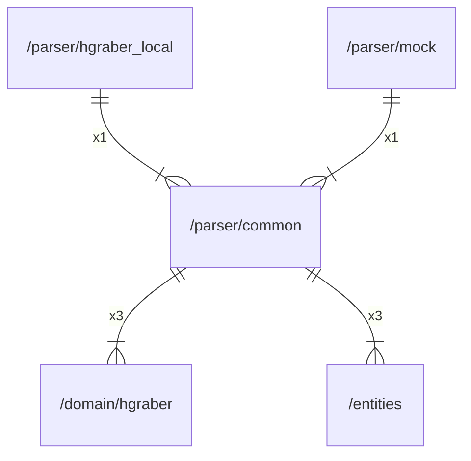

# common

## Imports

|   Name   |                  Path                   | Inner | Count |
|:--------:|:---------------------------------------:|:-----:|:-----:|
| context  |                 context                 |  ❌   |   3   |
| hgraber  | [/domain/hgraber](../domain/hgraber.md) |  ✅   |   3   |
| entities |       [/entities](../entities.md)       |  ✅   |   3   |
|   fmt    |                   fmt                   |  ❌   |   2   |
|   url    |                 net/url                 |  ❌   |   2   |
|   pkg    |   github.com/gbh007/hgraber-next/pkg    |  ❌   |   1   |
|   html   |                  html                   |  ❌   |   1   |
|    io    |                   io                    |  ❌   |   1   |
|   http   |                net/http                 |  ❌   |   1   |
|  regexp  |                 regexp                  |  ❌   |   1   |
| strings  |                 strings                 |  ❌   |   1   |

## Used by

|     Name      |                   Path                    |
|:-------------:|:-----------------------------------------:|
| hgraber_local | [/parser/hgraber_local](hgraber_local.md) |
|     mock      |          [/parser/mock](mock.md)          |

## Scheme

---

> Generated by [goArchLint](https://github.com/gbh007/goarchlint)
