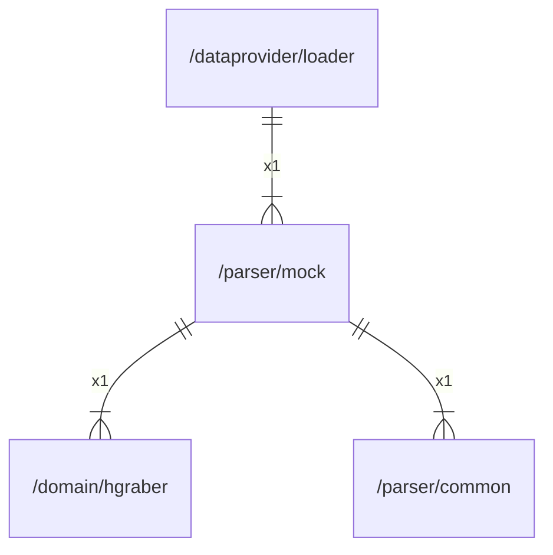

# mock

## Imports

|  Name   |                  Path                   | Inner | Count |
|:-------:|:---------------------------------------:|:-----:|:-----:|
| context |                 context                 |  ❌   |   1   |
| errors  |                 errors                  |  ❌   |   1   |
|   fmt   |                   fmt                   |  ❌   |   1   |
| hgraber | [/domain/hgraber](../domain/hgraber.md) |  ✅   |   1   |
| common  |       [/parser/common](common.md)       |  ✅   |   1   |
|   url   |                 net/url                 |  ❌   |   1   |
| regexp  |                 regexp                  |  ❌   |   1   |
| strings |                 strings                 |  ❌   |   1   |

## Used by

|  Name  |                       Path                        |
|:------:|:-------------------------------------------------:|
| loader | [/dataprovider/loader](../dataprovider/loader.md) |

## Scheme

---

> Generated by [goArchLint](https://github.com/gbh007/goarchlint)
