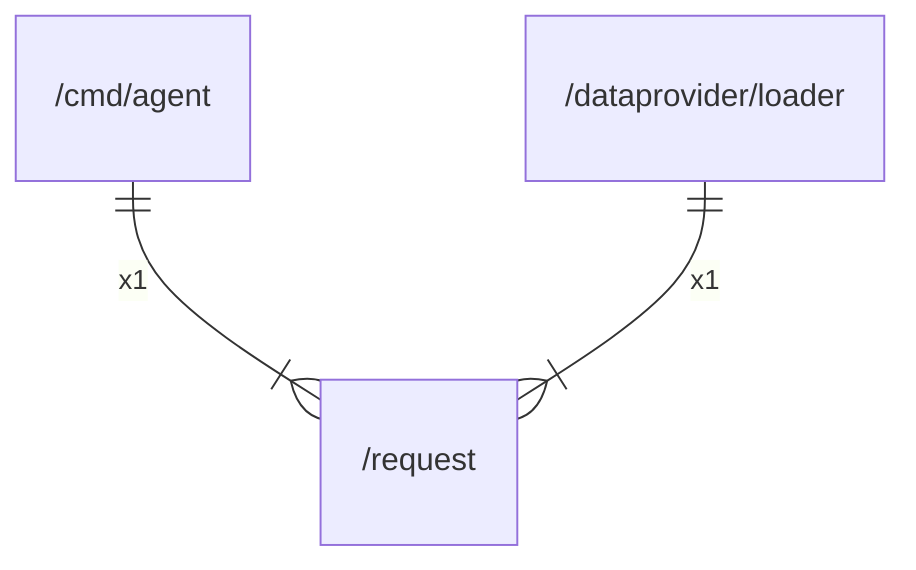

# request

## Imports

|    Name     |                             Path                              | Inner | Count |
|:-----------:|:-------------------------------------------------------------:|:-----:|:-----:|
|   context   |                            context                            |  ❌   |   3   |
|    bytes    |                             bytes                             |  ❌   |   2   |
|     io      |                              io                               |  ❌   |   2   |
|    http     |                           net/http                            |  ❌   |   2   |
|     fmt     |                              fmt                              |  ❌   |   1   |
|  otelhttp   | go.opentelemetry.io/contrib/instrumentation/net/http/otelhttp |  ❌   |   1   |
| propagation |             go.opentelemetry.io/otel/propagation              |  ❌   |   1   |
|    slog     |                           log/slog                            |  ❌   |   1   |
|    time     |                             time                              |  ❌   |   1   |

## Used by

|  Name  |                      Path                      |
|:------:|:----------------------------------------------:|
| agent  |           [/cmd/agent](cmd/agent.md)           |
| loader | [/dataprovider/loader](dataprovider/loader.md) |

## Scheme

---

> Generated by [goArchLint](https://github.com/gbh007/goarchlint)
