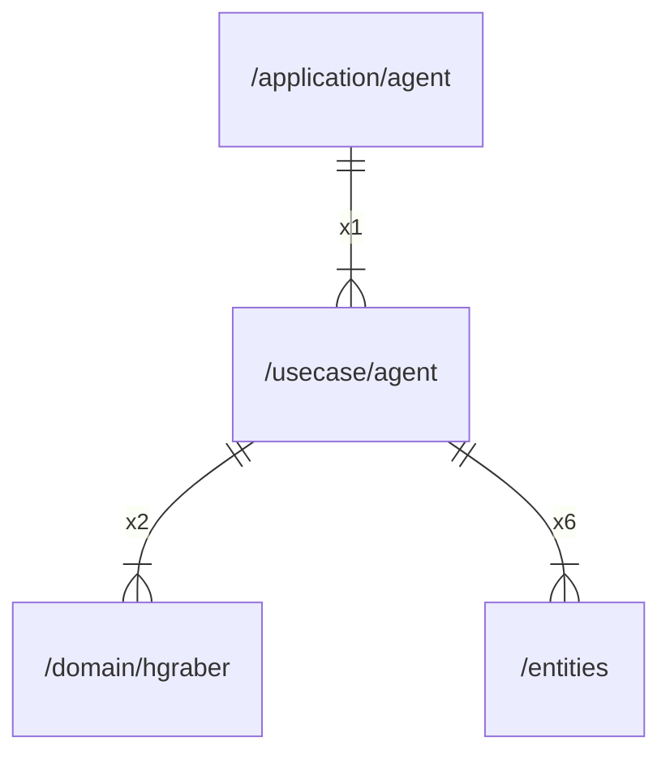

# agent

## Imports

|   Name   |                  Path                   | Inner | Count |
|:--------:|:---------------------------------------:|:-----:|:-----:|
| context  |                 context                 |  ❌   |   7   |
| entities |       [/entities](../entities.md)       |  ✅   |   6   |
|   url    |                 net/url                 |  ❌   |   6   |
|   fmt    |                   fmt                   |  ❌   |   3   |
| hgraber  | [/domain/hgraber](../domain/hgraber.md) |  ✅   |   2   |
|    io    |                   io                    |  ❌   |   2   |
|  errors  |                 errors                  |  ❌   |   1   |
|   pkg    |   github.com/gbh007/hgraber-next/pkg    |  ❌   |   1   |
|   slog   |                log/slog                 |  ❌   |   1   |

## Used by

| Name  |                     Path                      |
|:-----:|:---------------------------------------------:|
| agent | [/application/agent](../application/agent.md) |

## Scheme

---

> Generated by [goArchLint](https://github.com/gbh007/goarchlint)
