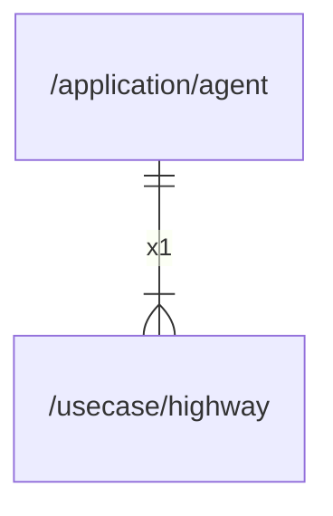

# highway

## Imports

|  Name   |          Path          | Inner | Count |
|:-------:|:----------------------:|:-----:|:-----:|
| context |        context         |  ❌   |   1   |
|   fmt   |          fmt           |  ❌   |   1   |
|  uuid   | github.com/google/uuid |  ❌   |   1   |
|   io    |           io           |  ❌   |   1   |
|  time   |          time          |  ❌   |   1   |

## Used by

| Name  |                     Path                      |
|:-----:|:---------------------------------------------:|
| agent | [/application/agent](../application/agent.md) |

## Scheme

---

> Generated by [goArchLint](https://github.com/gbh007/goarchlint)
